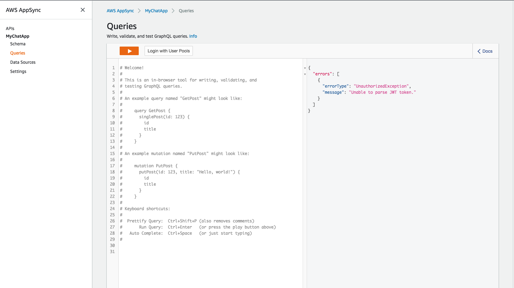
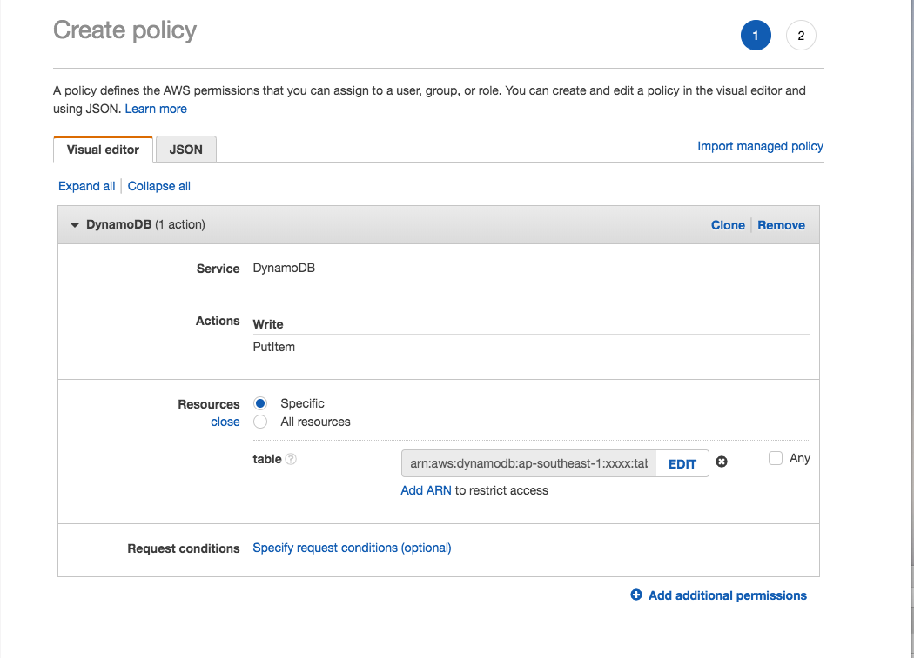
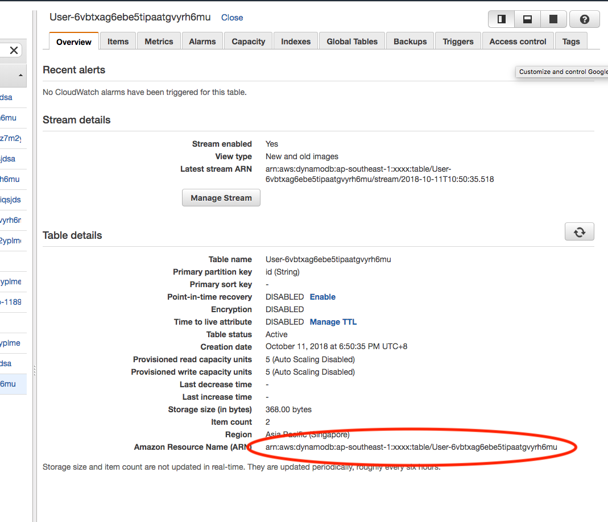

# AppSync
AWS AppSync automatically updates the data in web and mobile applications in real time, and updates data for offline users as soon as they reconnect. AWS AppSync makes it easy to build collaborative mobile and web applications that deliver responsive, collaborative user experiences.

## Table of Contents

* [Create AppSync API](#create-appsync-api)
* [Edit your GraphQL Schema](#edit-your-graphql-schema)
* [Test your query](#test-your-query)
* [Cognito User Pool Triggers](#cognito-user-pool-triggers)

## Create AppSync API

```
amplify api add
```

At this point, you will see either GraphQL or REST. In this lab, we will create the AWS AppSync by selecting GraphQL. 
```
? Please select from one of the below mentioned services (Use arrow keys)
❯ GraphQL 
  REST 
```

Enter the API name: `jiojiome`

At this point, choose `Amazon Cognito User Pool` as your autorization type for this API.


Select 'N' as you do not have an anootated GraphQL schema yet.

Select 'Y' for guided schema creation and edit the schema now. You should see:

```
? Do you have an annotated GraphQL schema? No
? Do you want a guided schema creation? true
? What best describes your project: (Use arrow keys)
? What best describes your project: Single object with fields (e.g., “Todo” with ID, name, description)
? Do you want to edit the schema now? (Y/n) 
? Do you want to edit the schema now? Yes
Please manually edit the file created at /code/amplify/backend/api/jiojiome/schema.graphql
```

Go to the schema file and start editing.


Copy the following and replace the schema:
```
type User @model {
  id: ID!
  name: String
  email: String!
  phone_number: String
  username: String
  events: [Event] @connection(name: "UserEvents")
  chats: [Chat] @connection(name: "UserChats")
  followers: [Follower] @connection(name: "UserFollowers")
}
type Event @model {
  id: ID!
  title: String!
  description: String
  status: String
  user: User @connection(name: "UserEvents")
  chats: [Chat] @connection(name: "EventChats")
  followers: [Follower] @connection(name: "EventFollowers")
  startAt: Int
}
type Chat @model {
  id: ID!
  content: String!
  user: User @connection(name: "UserChats")
  event: Event @connection(name: "EventChats")
  createdAt: String
}
type Follower @model {
  id: ID!
  user: User @connection(name: "UserFollowers")
  event: Event @connection(name: "EventFollowers")
}
```

Next, saved the file and go back to your Cloud9 terminal, Press `Enter` to continue. You should see the following messages:
```
Successfully added resource test2 locally

Some next steps:
"amplify push" will build all your local backend resources and provision it in the cloud
"amplify publish" will build all your local backend and frontend resources (if you have hosting category added) and provision it in the cloud
```

Enter the following command to see the changes:
```
amplify status
```

You should see:

```
| Category | Resource name   | Operation | Provider plugin   |
| -------- | --------------- | --------- | ----------------- |
| Auth     | cognito742b133c | No Change | awscloudformation |
| Api      | jiojiome        | Create    | awscloudformation |
```

Let's now push your changes to the AWS and it will take a few minutes to complete.

```
amplify push
```

## Edit your GraphQL Schema

Once done, let's edit your GraphQL schema to add in some capabilities. With an annotated schema, we can write the following:

```
type Event @model {
  id: ID!
  title: String!
  description: String
  status: String
  user: User @connection(name: "UserEvents")
  chats: [Chat] @connection(name: "EventChats")
  followers: [Follower] @connection(name: "EventFollowers")
  startAt: Int
}
```

With Amplify CLI, you get a CRUD API with paging and filtering built-in; input types are created for each of the mutations and subscriptions are set up on each mutation; the backing store in a DynamoDB database. Now, let's back the data store with AWS ElasticSearch Service - this is good for basic searches and filtering, but you may want better searchability of your data. For example, you might want to do geo-lookups, or faceted search. For this sort of functionality, it would be a good idea to stream the data from DynamoDB to an ElasticSearch Service. To do that, add the @searchable directive to the type:

```
type Event @model @searchable {
  id: ID!
  title: String!
  description: String
  status: String
  user: User @connection(name: "UserEvents")
  chats: [Chat] @connection(name: "EventChats")
  followers: [Follower] @connection(name: "EventFollowers")
  startAt: Int
}
```

Save the file again, and enter the following command to push your changes to the AWS.

```
amplify push
```

## Test your query

1. Before you proceed to test your AppSync query, you will need your **ClientId** in the Cognito. Note that it is not your AWS access key. Go to your Cognito UserPool console, under App clients, you can find your respective **ClientId**.

2. Once you have found your ClientId, you can now go to **AppSync Queries**.
3. Click on **Login with User Pools** (Since you are using Cognito UserPool for API authorization, you will need to login as the Cognito user). Use the test user you set up in the previous lab.

4. Key in your **ClientId**, **Username** and **Password**. Note: you can find your **ClientId** in your Cognito console OR `aws-export.js` file. 
5. Click **Login**. At this time, you are prompted to key in the new password for this account.

6. Now you can run your query, paste the following code into the query console:

```
query getUsers{
  listUsers{
    items {
      id
      name
    }
  }
}
```
7. Click on the "**Play**" button to run your query.
8. We do not have any users in our tables yet. You will see the result on the right side of the panel


Now you have successfully setup AppSync in your AWS environment. Let's configure Cognito User Pool's Trigger to add user details to DynamoDB.

## Cognito User Pool Triggers

First, let's add a new Lambda function in the AWS Console.

1. Go to [AWS Lambda Console](https://ap-southeast-1.console.aws.amazon.com/lambda/home?region=ap-southeast-1#/functions)
2. Click "Create function" button at the top right hand corner
3. At the Create function, select "Author from scratch", put in the following details:
    - Name: lambda-cognito-dynamodb-table-put
    - Runtime: Python 3.6
    - Role: Choose a new role
    - Role Name: lamba-cognito-dynamodb-execution
4. Click "Create function" to proceed
5. At the function code, copy/replace the code from `/code/lambda/lambda-cognito-dynamodb-table-put.py` 
6. At the top right corner, click "Save" to proceed.

Now, that we have setup the Lambda function, we need to give the function the right IAM permission. 

1. Go to [AWS IAM Roles Console](https://console.aws.amazon.com/iam/home?region=ap-southeast-1#/roles)
2. Search for `lamba-cognito-dynamodb-execution` and click on the Role name
3. At the Permissions section, select **Attach policies** to begin
4. At the search bar, search for `Cognito` and select `AmazonCognitoReadOnly` to continue
5. Select **Attach policy**
6. Next, we will attach a permission for lambda to write to DynamoDB. Select **Add inline policy** to continue.

7. Key in the details as shown below:

Note that you can find your ARN for your dynamoDB table under DynamoDB console as shown below:

8. Once done, select **Review policy** to continue
9. Give the policy a name `lambda-cognito-dynamodb-policy`
10. Select **Create policy**

Now you should see your Role Summary with the right info below


Once you have your Lambda function ready, we can now attach this function as one of the Cognito user pool's trigger.

1. Go to the [AWS Cognito User Pool console](https://ap-southeast-1.console.aws.amazon.com/cognito/users)
2. Select your user pool
3. Go to triggers
4. At the *Post authentication* section, select your lambda function in the dropdown list
5. Scroll down, select **Save changes** at the bottom of the page

You are now set. Next, you can proceed to [Lab 4](../app) to run your React Native app on your mobile phone.
