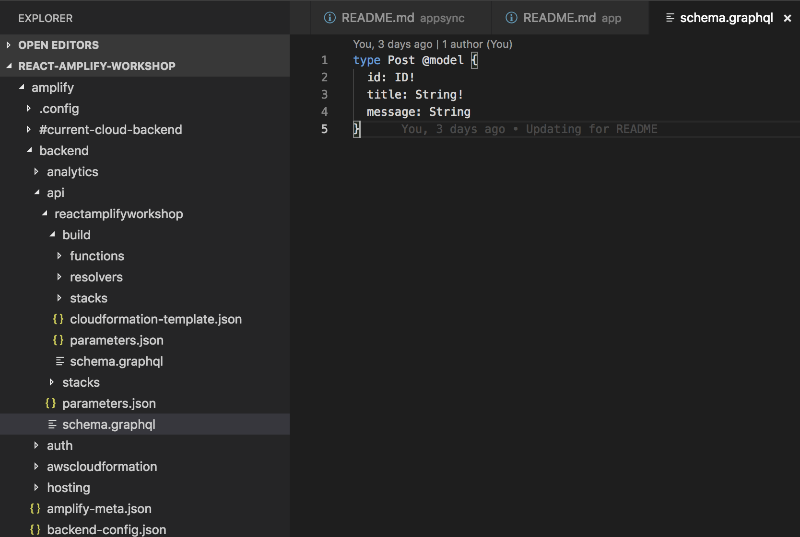
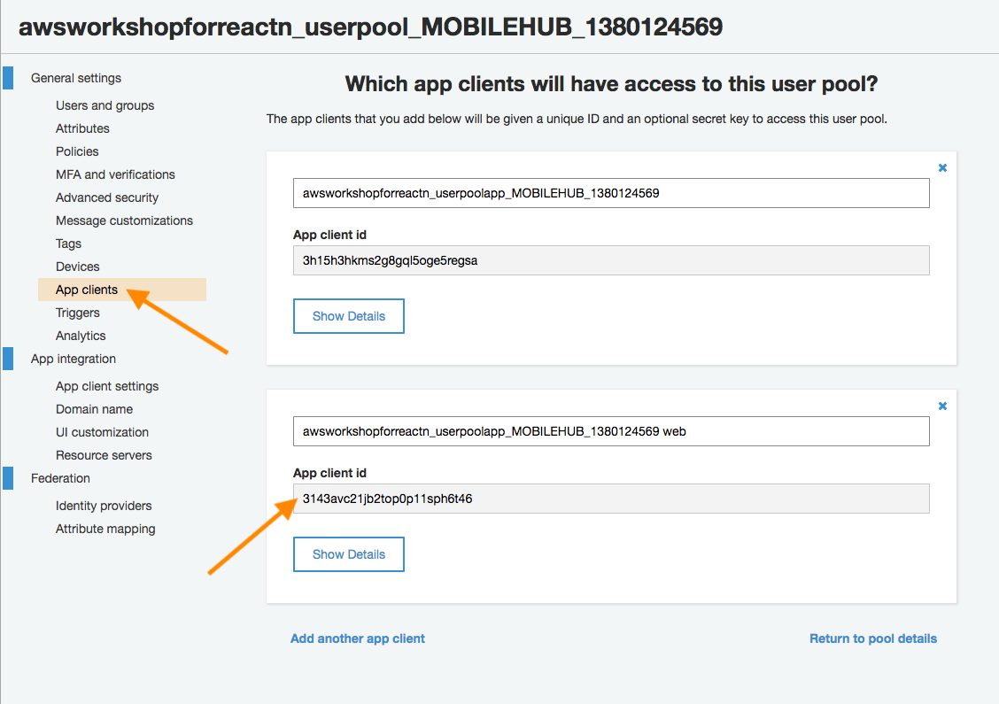
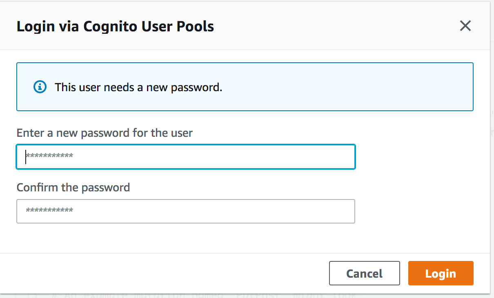
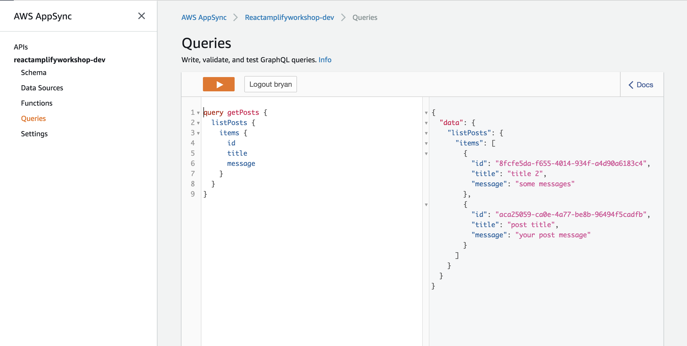

# AppSync
AWS AppSync automatically updates the data in web and mobile applications in real time, and updates data for offline users as soon as they reconnect. AWS AppSync makes it easy to build collaborative mobile and web applications that deliver responsive, collaborative user experiences.

## Table of Contents

* [Create AppSync API](#create-appsync-api)
* [Edit your GraphQL Schema](#edit-your-graphql-schema)
* [Test your query](#test-your-query)
* [Cognito User Pool Triggers](#cognito-user-pool-triggers)
* [Create Analytics]($create-analytics)

## Create AppSync API

```
amplify api add
```

At this point, you will see either GraphQL or REST. In this lab, we will create the AWS AppSync by selecting GraphQL. 
```
? Please select from one of the below mentioned services (Use arrow keys)
❯ GraphQL 
  REST 
```

Enter the API name: `workshop`

At this point, choose `Amazon Cognito User Pool` as your autorization type for this API.


Select 'N' as you do not have an anootated GraphQL schema yet.

Select 'Y' for guided schema creation and edit the schema now. You should see:

```
? Do you have an annotated GraphQL schema? No
? Do you want a guided schema creation? true
? What best describes your project: (Use arrow keys)
? What best describes your project: Single object with fields (e.g., “Todo” with ID, name, description)
? Do you want to edit the schema now? (Y/n) 
? Do you want to edit the schema now? Yes
Please manually edit the file created at /code/amplify/backend/api/workshop/schema.graphql
```

Go to the schema file and start editing.



Copy the following and replace the schema:
```
type Post @model {
  id: ID!
  title: String!
  message: String
}
```

Next, saved the file and go back to your Cloud9 terminal, Press `Enter` to continue. You should see the following messages:
```
Successfully added resource test2 locally

Some next steps:
"amplify push" will build all your local backend resources and provision it in the cloud
"amplify publish" will build all your local backend and frontend resources (if you have hosting category added) and provision it in the cloud
```

Enter the following command to see the changes:
```
amplify status
```

You should see:

```
| Category | Resource name   | Operation | Provider plugin   |
| -------- | --------------- | --------- | ----------------- |
| Auth     | cognito742b133c | No Change | awscloudformation |
| Api      | workshop        | Create    | awscloudformation |
```

Let's now push your changes to the AWS and it will take a few minutes to complete.

Note that you have an option to auto generate code for your newly created GraphQL API when you push your changes to the backend.

```
amplify push
```


## Test your query

1. Before you proceed to test your AppSync query, you will need your **ClientId** in the Cognito. Note that it is not your AWS access key. Go to your Cognito UserPool console, under App clients, you can find your respective **ClientId**.

2. Once you have found your ClientId, you can now go to **AppSync Queries**.
3. Click on **Login with User Pools** (Since you are using Cognito UserPool for API authorization, you will need to login as the Cognito user). Use the test user you set up in the previous lab.

4. Key in your **ClientId**, **Username** and **Password**. Note: you can find your **ClientId** in your Cognito console OR `aws-export.js` file. 
5. Click **Login**. At this time, you are prompted to key in the new password for this account.

6. Now you can run your query, paste the following code into the query console:

```
query getPosts {
  listPosts {
    items {
      id
      title
      message
    }
  }
}
```
7. Click on the "**Play**" button to run your query.
8. We do not have any users in our tables yet. You will see the result on the right side of the panel


Now you have successfully setup AppSync in your AWS environment. 

## Create Analytics

The Analytics category enables you to collect analytics data for your app. The Analytics category comes with built-in support for Amazon Pinpoint and Amazon Kinesis.

```
amplify add analytics
```

The CLI will prompt configuration options for the Analytics category such as Amazon Pinpoint resource name and analytics event settings. You should see:

```
Using service: Pinpoint, provided by: awscloudformation
? Provide your pinpoint resource name: reactamplifyworkshop
Adding analytics would add the Auth category to the project if not already added.
? Apps need authorization to send analytics events. Do you want to allow guests and unauthenticated users to send analytics events? (we recommend you allow this when getting started) Yes
Successfully updated auth resource locally.
Successfully added resource reactamplifyworkshop locally

Some next steps:
"amplify push" builds all of your local backend resources and provisions them in the cloud
"amplify publish" builds all your local backend and front-end resources (if you have hosting category added) and provisions them in the cloud
```

To update your backend run:
```
amplify push
```

Wait for the backend to finish the update. Once done, you can proceed to the [next section](../app).